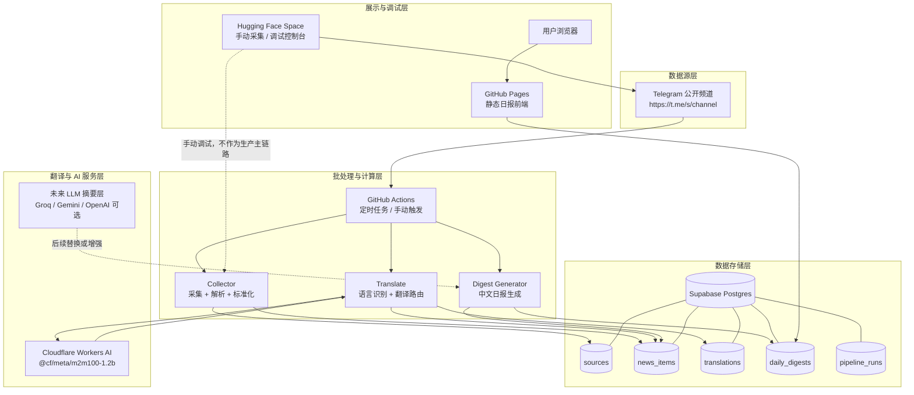
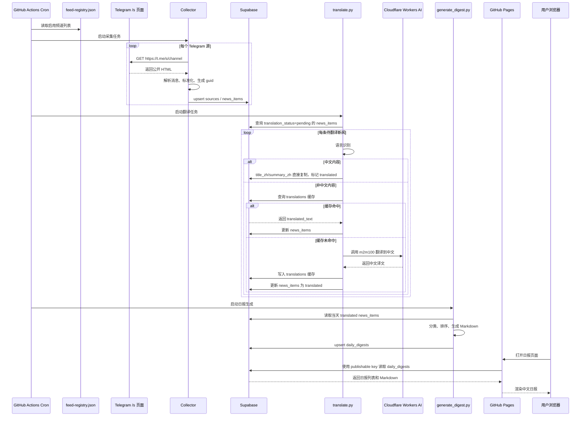
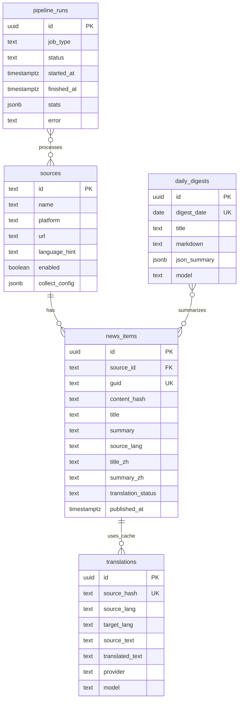
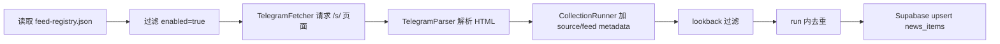
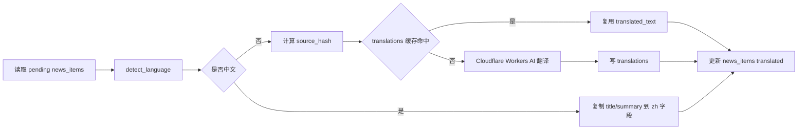
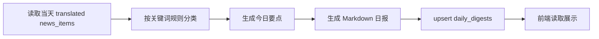

# 系统架构与数据链路

更新时间：2026-05-07

本文档用于中文说明当前财经新闻数据管道的跨平台系统架构、平台职责、数据链路和后续扩展方向。

## 一、当前完成程度

当前系统已经完成最小可用闭环：

```text
Telegram 公开频道
  -> GitHub Actions 定时采集
  -> Supabase 存储
  -> Cloudflare Workers AI 翻译
  -> 规则版中文日报生成
  -> GitHub Pages 静态网页展示
  -> Hugging Face Space 手动调试
```

已完成：

- Telegram `/s/` 静态页采集器。
- Supabase 数据库表结构。
- GitHub Actions 自动批处理。
- Cloudflare Workers AI 翻译接入。
- `translations` 翻译缓存。
- `daily_digests` 日报表。
- GitHub Pages 静态前端。
- Hugging Face Space 手动采集控制台。
- 当前配置 10 个 Telegram 源。

下一阶段建议：

- 将规则版日报升级为 LLM 结构化中文摘要。
- 给新闻源增加质量权重和过滤策略。
- 前端增加来源筛选、日期筛选、关键词搜索。
- 将每次流水线运行状态写入 `pipeline_runs`。
- 增加失败通知，例如 Telegram Bot 或 Discord Webhook。

## 二、整体跨平台系统架构图



## 三、生产数据链路交互图



## 四、平台职责总览

| 平台 | 当前职责 | 关键配置 | 后续提升空间 |
|---|---|---|---|
| Telegram | 公开频道数据源 | 使用 `/s/` 静态页 | 增加更多频道、源质量评分 |
| GitHub Actions | 定时采集、翻译、生成日报 | Repository Secrets | 拆分 job、失败重试、运行日志 |
| Supabase | 主数据库 | SQL schema + service key | 搜索、RLS 细化、视图、索引 |
| Cloudflare Workers AI | 非中文翻译 | Account ID + API Token | 批量翻译、额度控制、fallback |
| GitHub Pages | 日报网页展示 | Pages source = GitHub Actions | 搜索、筛选、详情页 |
| Hugging Face Space | 手动调试控制台 | Gradio Space | 备用 API、手动回填、翻译兜底 |

## 五、各平台部署条件和参数

### 1. Telegram

使用方式：

```text
https://t.me/s/<channel>
```

新增源文件：

```text
src/config/feed-registry.json
```

验证命令：

```powershell
python scripts\fetch_finance_news_daily.py --url https://t.me/s/<channel> --limit 3 --json
```

关键配置：

```json
{
  "feed_id": "tg_example",
  "source_id": "tg_example",
  "source_name": "Example",
  "platform": "telegram",
  "url": "https://t.me/s/example",
  "language_hint": "en",
  "enabled": true,
  "collect": {
    "lookback_hours": 24,
    "max_items_per_run": 20,
    "timeout_ms": 12000,
    "retries": 2
  }
}
```

### 2. GitHub Actions

仓库：

```text
https://github.com/vlnk2023/finance-news-daily-pipeline
```

主要 workflow：

```text
.github/workflows/daily-collect.yml
.github/workflows/deploy-web.yml
```

需要配置的 Repository Secrets：

```text
SUPABASE_URL
SUPABASE_SERVICE_ROLE_KEY
CLOUDFLARE_ACCOUNT_ID
CLOUDFLARE_API_TOKEN
SUPABASE_PUBLISHABLE_KEY
```

配置入口：

```text
GitHub 仓库 -> Settings -> Secrets and variables -> Actions -> Repository secrets
```

手动运行生产流水线：

```text
Actions -> Daily Finance Collect -> Run workflow
```

手动部署前端：

```text
Actions -> Deploy Digest Web -> Run workflow
```

### 3. Supabase

项目地址：

```text
https://ujhbempmdbilzajdrhsz.supabase.co
```

建表 SQL：

```text
migrations/supabase/0001_pipeline_schema.sql
```

获取参数：

```text
Supabase Dashboard -> Project Settings -> API
```

对应关系：

```text
Project URL -> SUPABASE_URL
Secret keys / service_role -> SUPABASE_SERVICE_ROLE_KEY
Publishable key 或 legacy anon -> SUPABASE_PUBLISHABLE_KEY
```

安全要求：

```text
sb_secret_... 只能放服务端和 GitHub Secrets
Publishable key / anon key 可以用于前端只读
```

当前表：

```text
sources
news_items
translations
daily_digests
pipeline_runs
```

### 4. Cloudflare Workers AI

当前模型：

```text
@cf/meta/m2m100-1.2b
```

用途：

```text
非中文新闻 -> 中文翻译
```

获取 `CLOUDFLARE_ACCOUNT_ID`：

```text
Cloudflare Dashboard -> 选择账号 -> Account ID
```

创建 `CLOUDFLARE_API_TOKEN`：

```text
My Profile -> API Tokens -> Create Token -> Custom token
```

权限建议：

```text
Account -> Workers AI -> Edit
```

作用范围：

```text
只选择当前 Cloudflare Account
```

代码位置：

```text
collector/translation/cloudflare.py
scripts/translate.py
```

### 5. GitHub Pages

用途：

```text
展示 daily_digests 中文日报
```

前端目录：

```text
web/
```

部署 workflow：

```text
.github/workflows/deploy-web.yml
```

Pages 设置：

```text
GitHub 仓库 -> Settings -> Pages -> Build and deployment -> Source -> GitHub Actions
```

访问地址：

```text
https://vlnk2023.github.io/finance-news-daily-pipeline/
```

前端数据读取：

```text
Supabase daily_digests
```

浏览器使用：

```text
SUPABASE_PUBLISHABLE_KEY
```

不会暴露：

```text
SUPABASE_SERVICE_ROLE_KEY
```

### 6. Hugging Face Space

用途：

```text
手动采集、调试、演示
```

地址：

```text
https://huggingface.co/spaces/phily23/trans26
```

入口：

```text
app.py
```

Space 配置：

```text
README.md frontmatter
sdk: gradio
app_file: app.py
```

当前职责：

- 手动选择 feed。
- 输入自定义 Telegram URL。
- 查看解析表格。
- 查看 raw JSON。

后续可扩展：

- `/health`
- `/collect_once`
- `/translate_batch`
- 手动历史回填。
- 备用翻译 API。

## 六、数据表之间的关系



## 七、模块级流程图

### 采集模块



### 翻译模块



### 日报模块



## 八、当前主要提升空间

### 采集侧

- 增加更多来源类型，例如 RSS、网页、API。
- 增加频道权重和黑名单关键词。
- 支持历史回填模式。
- 支持每个 feed 的独立运行频率。

### 翻译侧

- Cloudflare m2m100 增加批量调用。
- 增加失败重试。
- 增加 Gemini/Groq/HF Space fallback。
- 增加翻译质量评分。
- 对超长文本做分块翻译。

### 日报侧

- 当前是规则版，后续应接 LLM。
- 增加结构化栏目：
  - 宏观政策
  - 市场表现
  - 科技与 AI
  - 网络安全
  - 地缘风险
  - 外汇与商品
- 增加新闻重要性排序。
- 增加去重聚类，避免多个源重复报道同一事件。

### 前端侧

- 增加日期路由。
- 增加搜索。
- 增加来源筛选。
- 增加原始新闻列表。
- 增加 markdown 导出。

### 运维侧

- 写入 `pipeline_runs`。
- 每次 Actions 失败发送通知。
- 显示最近一次流水线状态。
- 显示各来源最近采集时间。

## 九、下次对话建议

下次可以直接说：

```text
继续 docs/系统架构与数据链路.md 和 docs/system-handoff.md，下一步把规则版日报升级成 LLM 结构化中文日报。
```

或者：

```text
继续当前项目，给前端增加来源筛选和日期筛选。
```
